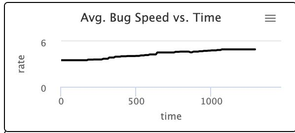
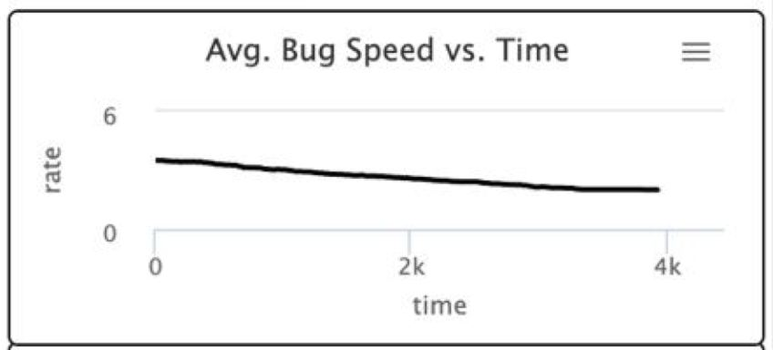
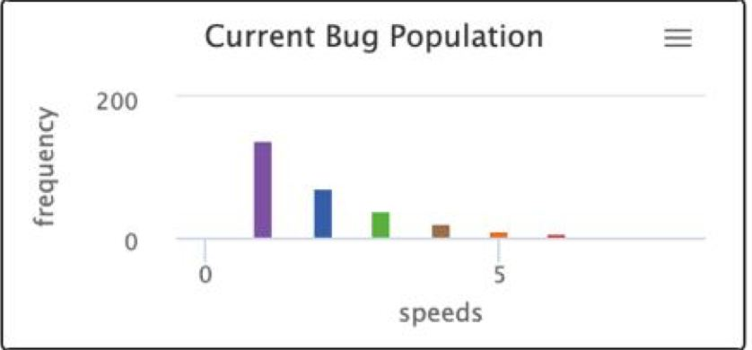

## Імітаційне моделювання комп'ютерних систем
## СПм-21-2, **Корнієнко Єгор Дмитрович**
### Додаткове завдання №**1**. Опис імітаційних моделей

 

### Обрана модель в середовищі NetLogo:
[Bug Hunt Speeds](http://www.netlogoweb.org/launch#http://www.netlogoweb.org/assets/modelslib/Sample%20Models/Biology/Evolution/Bug%20Hunt%20Speeds.nlogo)

 

### Вербальний опис моделі:
Модель природного/штучного відбору, яка показує результат дії двох конкуруючих сил на природний відбір швидкості жертви. Яка сила домінує, залежить від поведінки хижаків.

Однією з причин є те, що хижаки, які переслідують здобич, частіше ловлять здобич, яка рухається повільніше, вибираючи таким чином здобич, яка є швидшою протягом багатьох поколінь нащадків.

Інша сила полягає в тому, що хижаки, які чекають на свою здобич без руху, частіше ловлять здобич, яка рухається швидше, таким чином вибираючи здобич, яка є повільнішою протягом багатьох поколінь нащадків.

Крім того, регулюючи те, чи жуки намагаються уникати хижака, і передбачуваність їхнього руху, інша з цих конкуруючих сил буде прагнути домінувати над вибірковим тиском на популяцію.

### Керуючі параметри:
- **initial-bugs-each-speed** це кількість жуків, які ви починаєте в кожній із шести підгруп. Загальна популяція жуків визначається множенням цього значення на 6.

- **show-colors** - допомагає застосовувати або видаляти візуалізацію кольорів залежно від швидкості виявлення жуків. Коли він увімкнений, він показує 6 різних кольорів для 6 різних швидкостей, які може мати жук. Ці параметри кольорів відповідають кольорам пера на графіках. Коли вимкнено, кожен жук пофарбована в сірий колір. Це запобігає випадковому вибору жуків за кольором у хижака (гравця моделі).

- **wiggle** - коли встановлено на "on", додає невелику кількість випадкових поворотів у русі жуків, коли вони рухаються вперед кожного кроку в часі.

- **flee** - коли встановлено значення «увімкнено», жуки повертаються (розвертаються обличчям у протилежний бік), коли вони виявляють ваше клацання мишею (як хижак) у своєму конусі виявлення (дуга 120 градусів із діапазоном 2 одиниці) . Жуки можуть виявити хижака лише в цій дузі перед ними, тому не реагуватимуть, коли їх спіймають ззаду.

### Внутрішні параметри:
- **catches-by-speed**. Енергія для обох учасників процесу (вівці та вовка). Може відрізнятися у кожної тварини в різні моменти модельного часу.
- **speed** Швидкість для окремої популяції 

 

## Обчислювальні експерименти

### 1. Гістограма CURRENT BUGS має тенденцію зміщуватися праворуч (збільшення середньої швидкості), якщо ви берете на себе роль переслідування легкої здобичі.
Параметри системи, при яких здійснювалась симуляція:
- **initial-bugs-each-speed** : 48.
- **show-colors** : true.
- **wiggle** : true.
- **flee** : 50.

### 2. Гістограма CURRENT BUGS має тенденцію зміщуватися ліворуч (зменшується середня швидкість), якщо ви берете на себе роль очікування, коли до вас прийде жертва. Такого ж ефекту можна досягти, переміщаючи хижака по світу випадковим чином.
Параметри системи, при яких здійснювалась симуляція:
- **initial-bugs-each-speed** : 48.
- **show-colors** : true.
- **wiggle** : true.
- **flee** : 50.
Дослідження : 

### 3. Гістограма CURRENT BUGS Population демонструє, що при ролі очікування популяція повільних жуків росте, а швидких падає.
Параметри системи, при яких система є стабільною:
- **initial-bugs-each-speed** : 48.
- **show-colors** : true.
- **wiggle** : true.
- **flee** : 50.

Дослідження : 

