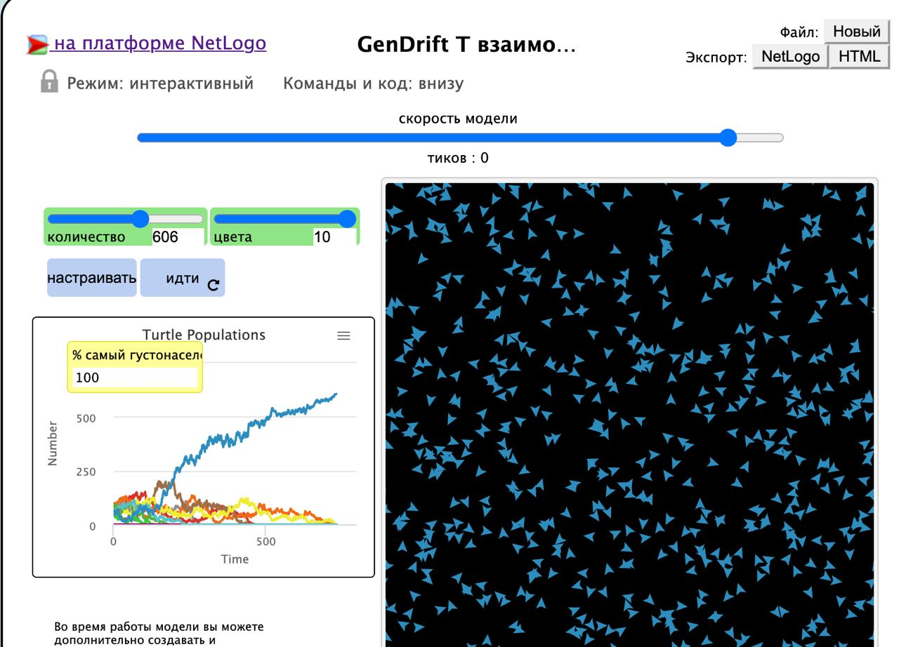
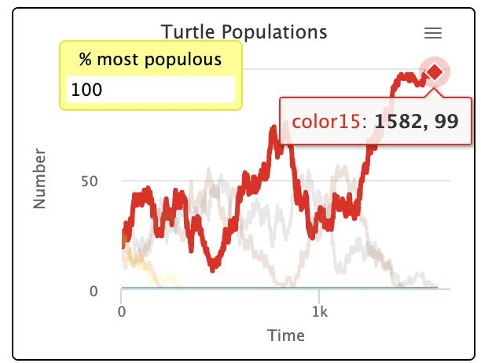
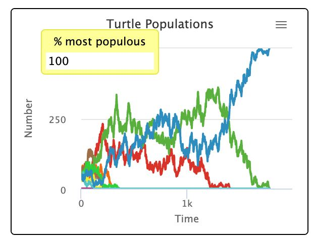
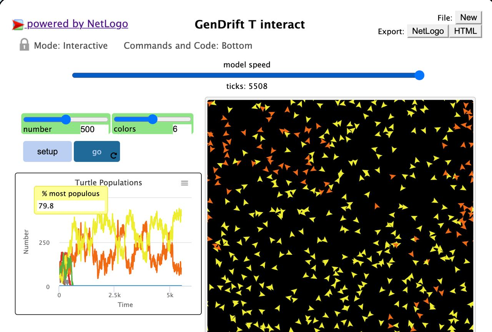
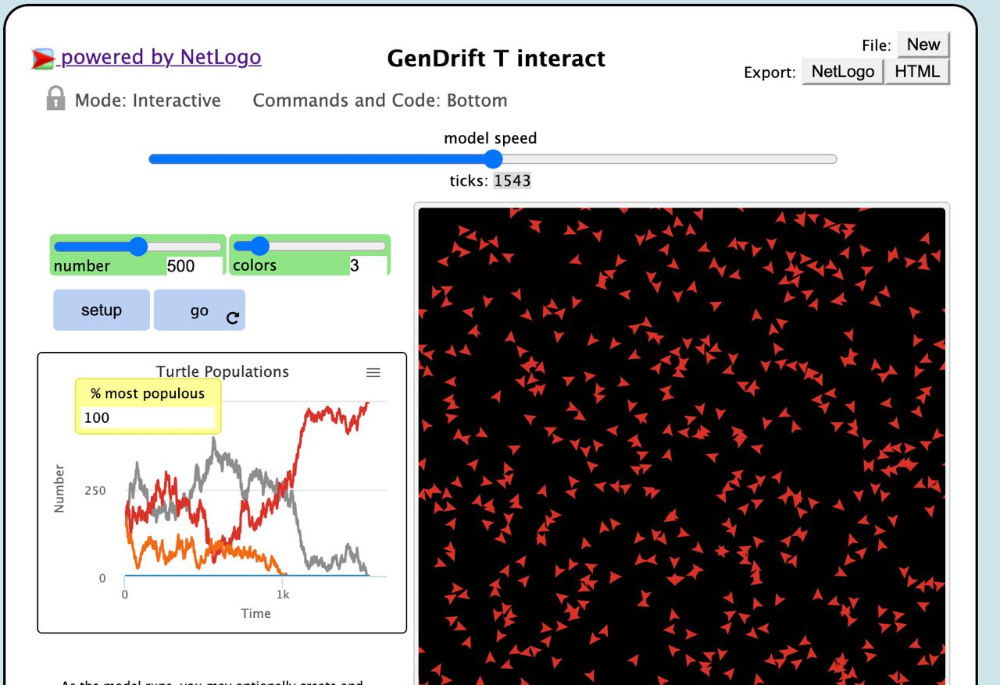

## Імітаційне моделювання комп'ютерних систем
## СПм-21-2, **Корнієнко Єгор Дмитрович**
### Додаткове завдання №**2**. Опис імітаційних моделей

 

### Обрана модель в середовищі NetLogo:
[GenDrift T interact](http://www.netlogoweb.org/launch#http://www.netlogoweb.org/assets/modelslib/Sample%20Models/Biology/Evolution/Genetic%20Drift/GenDrift%20T%20interact.nlogo)

 

### Вербальний опис моделі:
Ця модель є прикладом випадкового вибору. Це показує, що черепахи, які випадково міняються кольорами, сходяться до одного кольору. Ідея, більш детально пояснена в «Небезпечній ідеї Дарвіна» Деннета, полягає в тому, що дрейфи рис можуть відбуватися без будь-якої конкретної мети чи «вибіркового тиску».
Модель починається з випадкового розподілу кольорових агентів. Черепахи пересуваються по світу, хаотично погойдуючи. Коли дві черепахи знаходяться поруч, одна черепаха змінює свій колір на колір іншої. Зауважте, що якщо колір зникає, він ніколи не зможе повернутися.

### Керуючі параметри:
- **number** визначає початкову кількість черепах.
- **colors** визначає початкову кількість кольорів.

### Внутрішні параметри:
- ** most-populous**. Процент домінуючої популяції в співвідношенні до усієї кількості черепах на мапі

### Критерії ефективності системи:
- остаточна домінація однієї з популіцій.
- фінальна домінація популяції випадкова.

### Примітки:
- на початку на мапі не може бути менше двох черепах.

### Недоліки моделі:
- не має можливості розмноження черепах, тобто кількість черепах завжди однакова.

 

## Обчислювальні експерименти

### 1. Домінування одного кольору з пливом часу.
Поступово якийсь колір придбає легке домінування. Завдяки статистичним перевагам домінуючий колір має більше шансів мати більше подібних кольорів. 
Параметри системи, при яких здійснювалась симуляція:
- **number** : 100.
- **colors** : 5.

### 2. Домінація на проміжку не визначає домінацію в кінці.
Процес є випадковим, зазвичай буде серія домінуючих кольорів, перш ніж один колір остаточно переможе.
Досліджуємо залежність кількості вовків на тривалість їх популяцїї.
Параметри системи, при яких здійснювалась симуляція:
- **number** : 500.
- **colors** : 10.
Як можна побачити на рисунку домінація синього кольору не була прогнозована упродовж часу дослідження. Але в остаточному варіанті ми маємо 100 - відсоткову популяцію синього кольору.

### 3. Кількість кольорів - популяцій черепах не впливає на час встановлення однієї популяцїї.
Процес є випадковим, тому спрогнозувати, виокремити залежність не можна.
Параметри системи, при яких здійснювалась симуляція:
- **number** : 500.
- **colors** : 2-10.
- 
<table>
<thead>
<tr><th>Кількість кольорів</th><th>Час( кількість тактів ) встановлення домінантної популяції</th></tr>
</thead>
<tbody>
<tr><td>2</td><td>4597</td></tr>
<tr><td>3</td><td>2789</td></tr>
<tr><td>4</td><td>2890</td></tr>
<tr><td>5</td><td>1099</td></tr>
<tr><td>6</td><td>-</td></tr>
<tr><td>7</td><td>300</td></tr>
<tr><td>8</td><td>6021</td></tr>
<tr><td>9</td><td>2903</td></tr>
<tr><td>10</td><td>890</td></tr>
</tbody>
</table>

Дослідження на одному з етапів: 

Дослідження на одному з етапів:  

