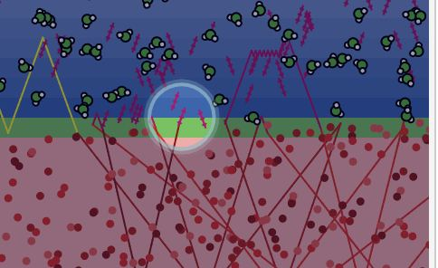
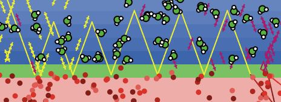
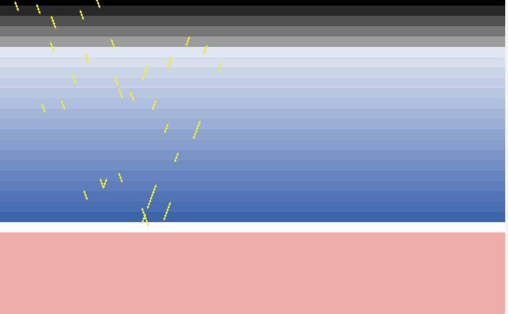
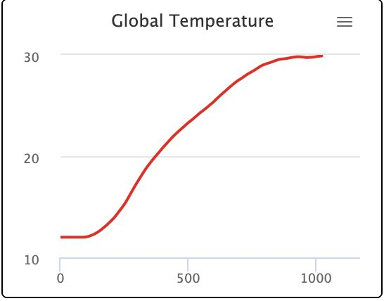
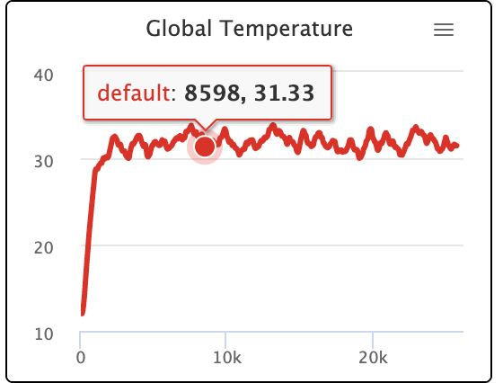
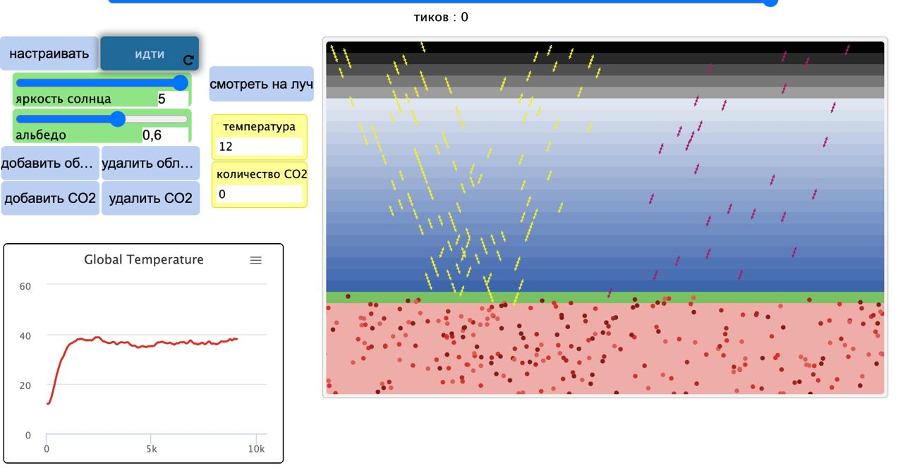

## Імітаційне моделювання комп'ютерних систем
## СПм-21-2, **Корнієнко Єгор Дмитрович**
### Додаткове завдання №**3**. Опис імітаційних моделей

 

### Обрана модель в середовищі NetLogo:
[Climate Change](http://www.netlogoweb.org/launch#http://www.netlogoweb.org/assets/modelslib/Sample%20Models/Earth%20Science/Climate%20Change.nlogo)

 

### Вербальний опис моделі:
Це модель потоку енергії в землі, зокрема теплової енергії. На ньому Земля зображена рожевого кольору, а поверхня планети зображена чорною смугою. Над смугою є синя атмосфера та чорний простір у верхній частині. В атмосферу можна додати хмари та молекули вуглекислого газу (CO2). Молекули CO2 являють собою парникові гази, які блокують інфрачервоне світло, яке випромінює Земля. Хмари блокують вхідні або вихідні сонячні промені, впливаючи на нагрівання або охолодження планети.
Жовті наконечники стрілок йдуть вниз, що символізує енергію сонячного світла. Частина сонячного світла відбивається від хмар, а більша частина може відбиватися від земної поверхні.
Якщо сонячне світло поглинається землею, воно перетворюється на червону крапку, що символізує теплову енергію. Кожна крапка представляє енергію однієї жовтої сонячної стріли. Червоні крапки хаотично рухаються навколо землі, а її температура залежить від загальної кількості червоних точок.
Іноді червоні точки перетворюються на інфрачервоне (ІЧ) світло, яке спрямовується в космос, несучи енергію. Імовірність того, що червона точка стане інфрачервоним світлом, залежить від температури землі. Коли земля холодна, кілька червоних крапок генерують ІЧ-світло; коли жарко, більшість так і робить. ІЧ-енергія представлена пурпуровою стрілкою. Кожен з них несе таку саму енергію, як жовта стріла та червона точка. ІЧ-світло проходить крізь хмари, але може відбиватися від молекул CO2.
Існує залежність між кількістю червоних точок на землі та температурою землі. Це пояснюється тим, що температура землі підвищується, оскільки загальна теплова енергія збільшується. Теплова енергія додається сонячним світлом, яке досягає землі, а також інфрачервоним (ІЧ) світлом, відбитим на землю. Теплова енергія знімається ІЧ-випромінюванням, яке випромінює Земля. Їх баланс визначає енергію в землі, яка пропорційна її температурі.

### Керуючі параметри:
- **SUN-BRIGHTNESS** Повзунок ЯСКРАВОСТІ СОНЦЯ контролює, скільки сонячної енергії надходить в земну атмосферу. Значення 1,0 відповідає нашому Сонцю. Більш високі значення дозволяють побачити, що станеться, якби Земля була ближче до сонця або якби сонце стало яскравішим..
- **ALBEDO** Повзунок ALBEDO контролює, скільки сонячної енергії, що потрапляє на землю, поглинається. Якщо альбедо дорівнює 1,0, Земля відбиває все сонячне світло. Це могло статися, якщо земля замерзла, і це вказує біла поверхня. Якщо альбедо дорівнює нулю, Земля поглинає все сонячне світло. Це позначено чорною поверхнею. Альбедо Землі становить приблизно 0,6..

### Внутрішні параметри:
- **temperature**. Поточна темпаратура землі
### Критерії ефективності системи:
- земля не змерзла (біла поверхня землі).

### Примітки:
- Якщо альбедо дорівнює 1,0, Земля відбиває все сонячне світло. Це могло статися, якщо земля замерзла, і це вказує біла поверхня. Якщо альбедо дорівнює нулю, Земля поглинає все сонячне світло. Це позначено чорною поверхнею. Альбедо Землі становить приблизно 0,6.

### Недоліки моделі:
- в есперименті не приймає участь людина, як обʼєкт генерації та споживання.
- видиме світло частково поглинається CO2, а частина інфрачервоного світла відбивається від хмар (в симуляції це було спрощено).

 

## Обчислювальні експерименти

### 1. Температура землі в залежності від відстані між сонцем та землею.
Протягом експерименту у всіх випадках генерувулося по 10 разів хмари та 10 разів додавалося CO2.
Параметри системи, при яких здійснювалась симуляція:
- **SUN-BRIGHTNESS** : 0.8 - 4.0.
- **ALBEDO** : 5.

<table>
<thead>
<tr><th>Яскравість сонця</th><th>Температура землі</th></tr>
</thead>
<tbody>
<tr><td>0.8</td><td>15.7</td></tr>
<tr><td>1.0</td><td>16.2</td></tr>
<tr><td>1.2</td><td>16.3</td></tr>
<tr><td>1.4</td><td>16.9</td></tr>
<tr><td>1.6</td><td>17.2</td></tr>
<tr><td>1.8</td><td>17.5</td></tr>
<tr><td>2.0</td><td>17.8</td></tr>
<tr><td>2.5</td><td>18</td></tr>
<tr><td>3.0</td><td>21.4</td></tr>
<tr><td>3.4</td><td>21.2</td></tr>
<tr><td>4.0</td><td>31</td></tr>
</tbody>
</table>

### 2. Вплив вуглекислого газу на нашу землю при стандартних показниках.
Параметри системи, при яких здійснювалась симуляція:
- **SUN-BRIGHTNESS** : 1.0.
- **ALBEDO** : 0.6.
- Кількість тактів - 1000.
Як можна побачити на рисунку 

<table>
<thead>
<tr><th>Кількість додатного вуглекислого газу за експеримент</th><th>Температура землі</th></tr>
</thead>
<tbody>
<tr><td>100</td><td>18</td></tr>
<tr><td>200</td><td>18.5</td></tr>
<tr><td>500</td><td>18.7</td></tr>
<tr><td>700</td><td>19</td></tr>
<tr><td>900</td><td>18.6</td></tr>
<tr><td>1000</td><td>19.4</td></tr>
<tr><td>1200</td><td>19.3</td></tr>
<tr><td>1500</td><td>19.1</td></tr>
</tbody>
</table>

### 3. Стабільність температури з будь яким значенням яскравості сонця.
Параметри системи, при яких здійснювалась симуляція:
- **SUN-BRIGHTNESS** : 0.8-4.0.
- **ALBEDO** : 0.6.
При стабілізації температури кількість вхідного сонця дорівнює кількості вихідного інфрачервоного випромінювання.
Система є стабілізацийною саме через це.

