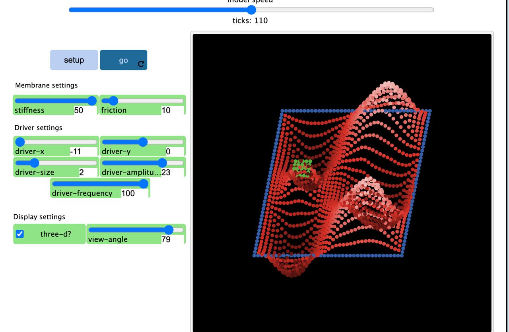
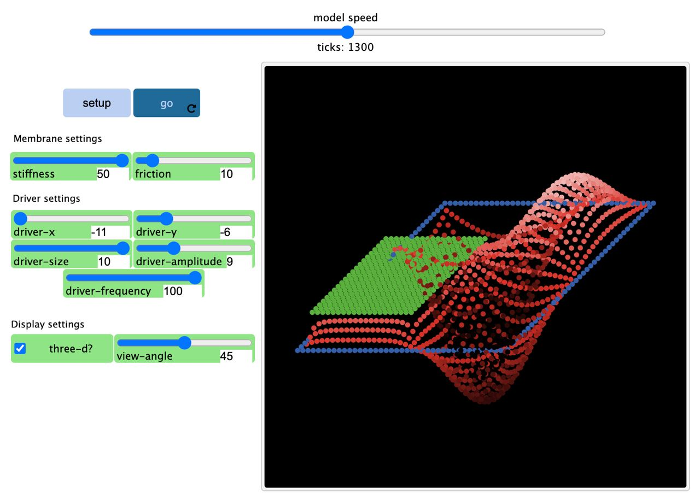
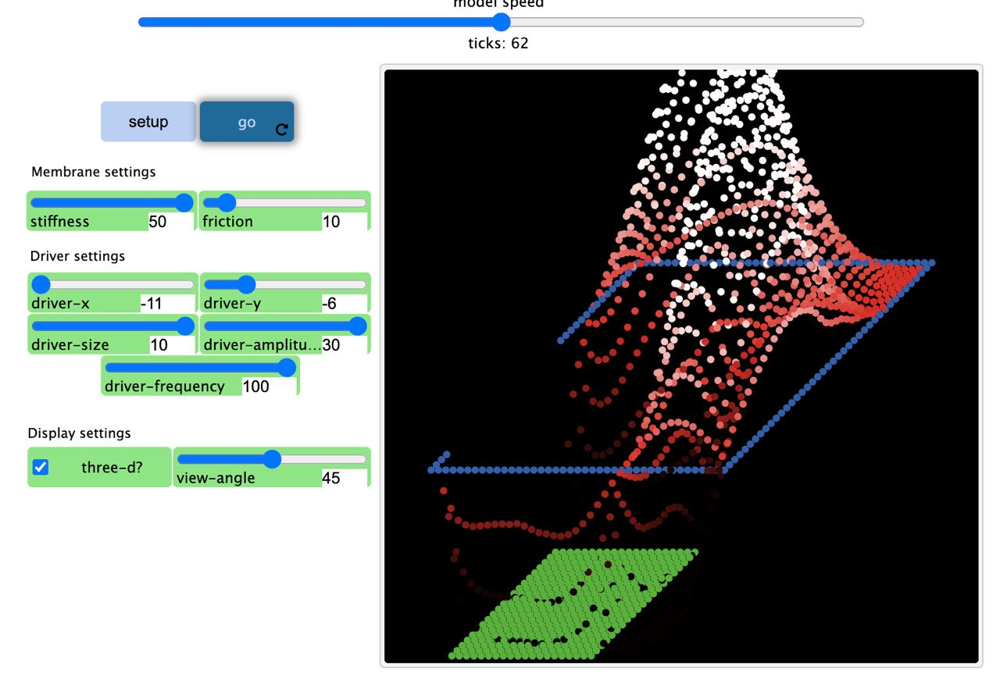
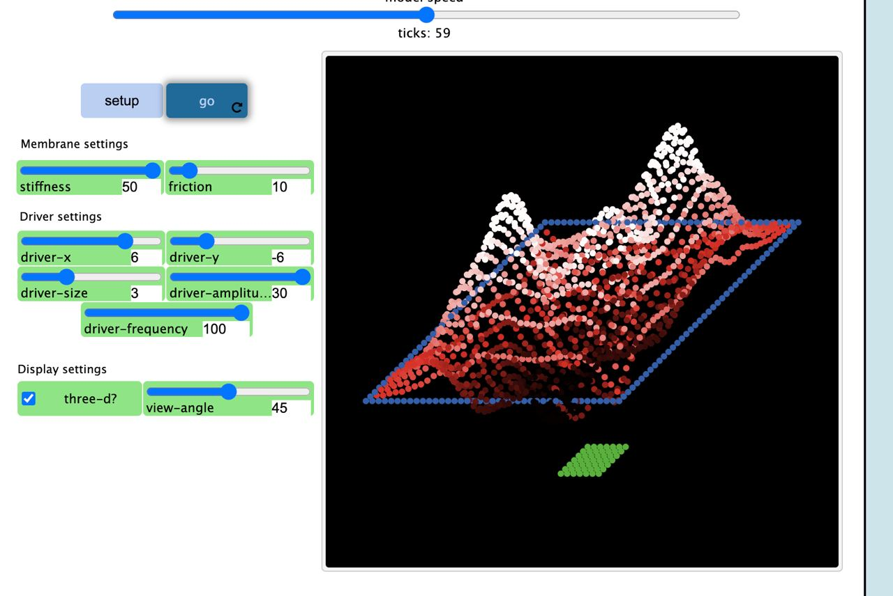
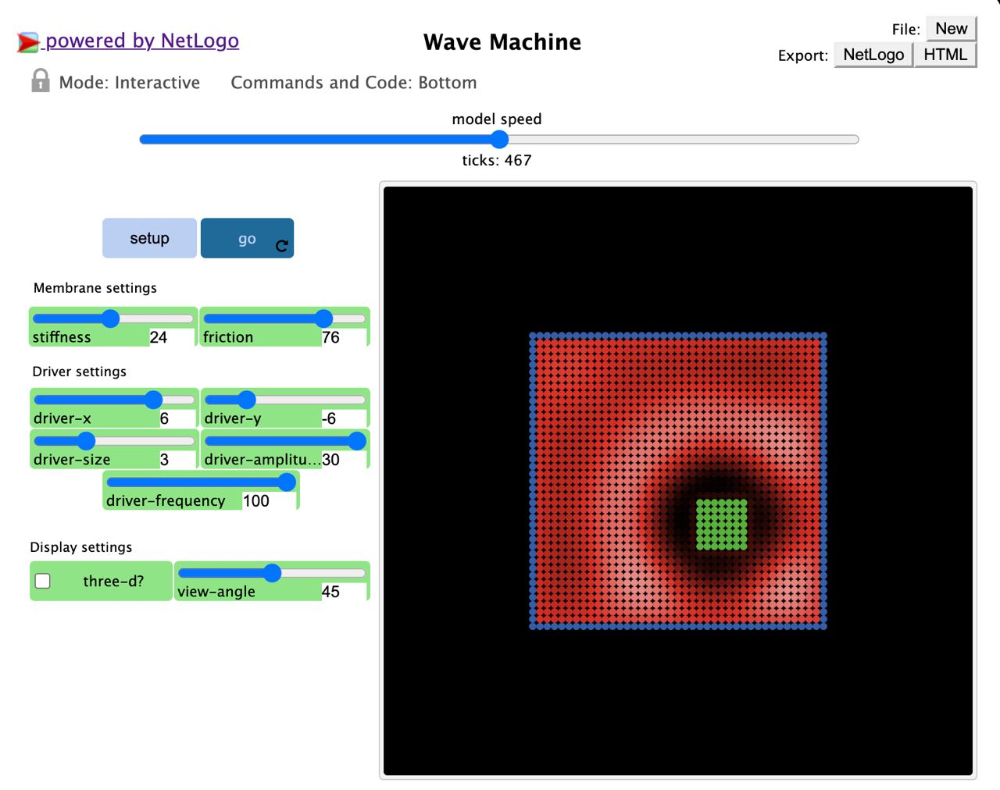

## Імітаційне моделювання комп'ютерних систем
## СПм-21-2, **Корнієнко Єгор Дмитрович**
### Додаткове завдання №**4**. Опис імітаційних моделей

 

### Обрана модель в середовищі NetLogo:
[Wave Machine](http://www.netlogoweb.org/launch#http://www.netlogoweb.org/assets/modelslib/Sample%20Models/Chemistry%20&%20Physics/Waves/Wave%20Machine.nlogo)

 

### Вербальний опис моделі:
Ця модель імітує хвильовий рух у мембрані. Чотири краї мембрани кріпляться до рами. Зелена прямокутна область представляє пластину драйвера, яка рухається вгору та вниз, виявляючи синусоїдальний рух.

Перетинка складається з ліній черепах. Кожна черепаха діє так, ніби вона з'єднана з чотирма сусідніми черепахами пружинами. У цій моделі черепахи рухаються лише вгору-вниз - напрямок сили Є лише вгору-вниз. Чим більша відстань між черепахою та її сусідами, тим сильніша сила.

Коли зелені черепахи рухаються вгору, вони «підтягують» черепах, які є їхніми сусідами, а ті, у свою чергу, підтягують черепах, які є їхніми сусідами, і так далі. Таким чином хвиля рухається по мембрані. Коли хвиля досягає країв мембрани (блакитні черепахи), хвиля відбивається назад до центру мембрани.

Амплітуда зелених черепах фіксована незалежно від жорсткості мембрани. Однак для переміщення жорсткої мембрани потрібно набагато більше сили, щоб перемістити її так само, як і нежорстку мембрану. Таким чином, навіть якщо жорсткість мембрани збільшується, висота хвилі залишатиметься незмінною, оскільки амплітуда залишається незмінною.

### Керуючі параметри:
- **number** визначає початкову кількість черепах.
- **colors** визначає початкову кількість кольорів.
- Контроль властивостей мембрани:
- **FRICTION** Повзунок ТЕРТЯ контролює величину тертя або ослаблення в мембрані. 
- **STIFFNESS** Повзунок ЖОРСТКІСТЬ контролює силу, що діє на черепаху через одиницю різниці відхилень між черепахою та чотирма її сусідами.

Контроль рушійної сили:

- **DRIVER-FREQUENCY** Повзунок DRIVER-FREQUENCY контролює частоту, з якою зелена зона мембрани (рушійна сила) рухається вгору та вниз. 
- **DRIVER-AMPLITUDE** Повзунок DRIVER-AMPLITUDE контролює максимальну висоту зеленої зони мембрани.

- **DRIVER-X / DRIVER-Y / DRIVER-SIZE** Повзунки DRIVER-X і DRIVER-Y керують положенням драйвера. Повзунок DRIVER-SIZE керує розміром драйвера.

### Критерії ефективності системи:
- закріплення та демонстрація фізичних законів.

### Недоліки моделі:
- неможливість зробити декілька джерел коливань.

 

## Обчислювальні експерименти

### 1. Імітація коливань.
Зверніть увагу на використання репортера черепах для пошуку черепах на сусідніх ділянках.

Ключовим кроком у розробці цієї моделі було створення внутрішньої системи координат. X, Y і Z — це лише три змінні, які належать черепахам. Ви можете уявити собі, що черепахи розташовані в 3-просторі та пересуваються в ньому. Але для відображення черепах у поданні, яке є двовимірним, три координати черепахи мають бути зіставлені у дві.

У двовимірному поданні координати черепахи x і y переводяться безпосередньо в координати NetLogo, а координата z вказується лише зміною кольору черепахи за допомогою примітиву кольору шкали.

У тривимірному поданні ізометрична проекція використовується для перетворення x, y та z (дійсне положення черепахи) у xcor та ycor (її положення на поданні). У цій проекції точка світу може відповідати більш ніж одній точці в 3-вимірній системі координат. Таким чином, у цій проекції ми все ще змінюємо колір черепахи відповідно до її z-положення, щоб допомогти оку розрізнити.

У 3-D версії немає сенсу для черепах «загортатися», якщо вони досягають вершини або низу світу, а також немає сенсу для них залишатися на вершині світу, тому черепахи ховаються, якщо їх обчислений ycor перевищує межі світу.

