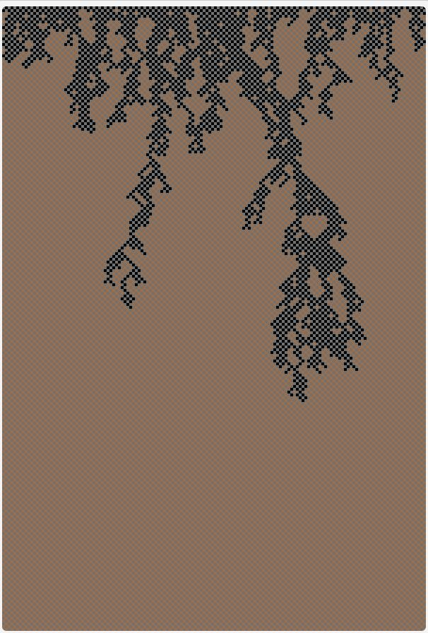
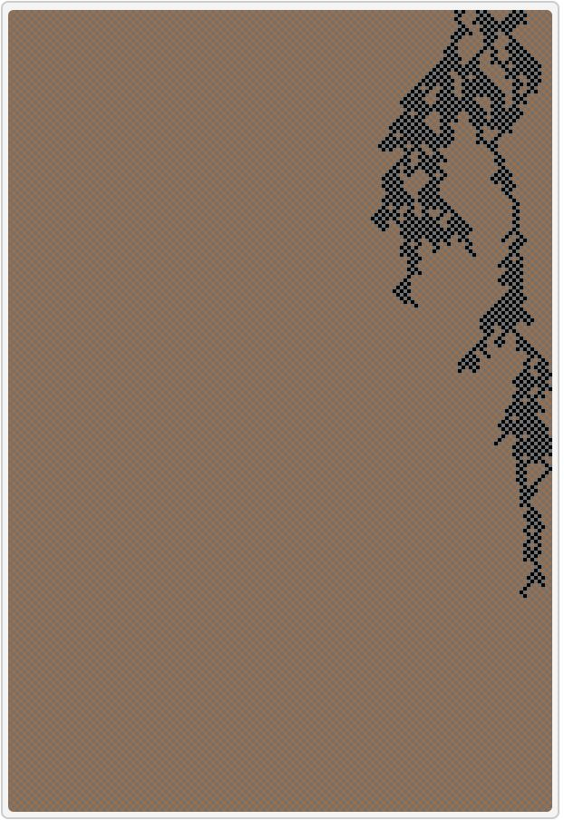
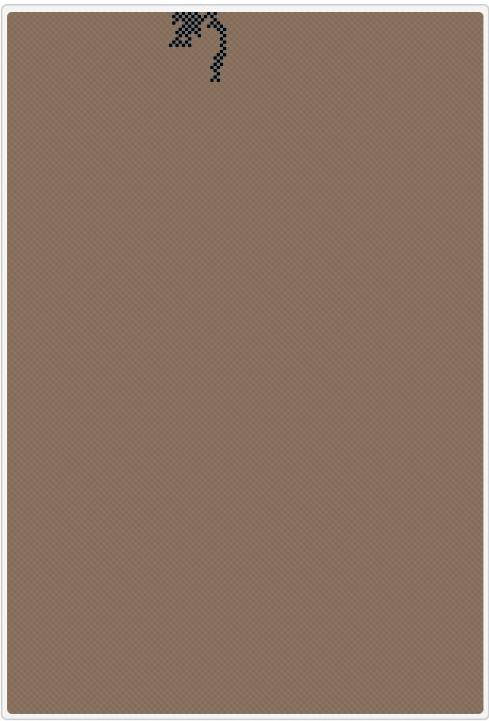

## Імітаційне моделювання комп'ютерних систем
## СПм-21-2, **Корнієнко Єгор Дмитрович**
### Додаткове завдання №**5**. Опис імітаційних моделей

 

### Обрана модель в середовищі NetLogo:
[Percolation](http://www.netlogoweb.org/launch#http://www.netlogoweb.org/assets/modelslib/Sample%20Models/Earth%20Science/Percolation.nlogo)

 

### Вербальний опис моделі:
Ця модель показує, як розлив нафти може просочуватися крізь водопроникний ґрунт.
Грунт моделюється у вигляді шахової дошки з твердих частинок (сірі квадрати) і напівпроникних просторів між цими твердими частинками (коричневі квадрати). (Можливо, вам знадобиться збільшити масштаб, щоб побачити окремі квадрати.)
Масло не може потрапити в суцільні сірі квадрати, але воно може пройти через коричневі квадрати.
Деякі ґрунти більш пористі («дірчасті»), ніж інші. У цій моделі величина пористості ґрунту визначає ймовірність того, що нафта зможе потрапити в будь-який даний квадрат бурого ґрунту.
Модель представляє розлив нафти у вигляді кінцевої кількості нафтових «частинок», або просто крапель нафти.
Розлив нафти починається у верхній частині огляду та просочується вниз.
Передній край розливу нафти представлений червоними квадратами, а кожен квадрат, через який нафта пройшла (або «насичена»), показаний чорним.
Краплі олії опускаються вниз крізь ґрунт, рухаючись по діагоналі вправо або вліво, прослизаючи між твердими сірими частинками.

### Керуючі параметри:
- **percolation** Повзунок ПОРИСТОСТІ контролює відсоткову ймовірність того, що нафта зможе потрапити в кожен коричневий квадрат, коли вона рухається вниз.

### Внутрішні параметри:
- **current-row** набір у поточному рядку
- **total-oil** відстежує, скільки ґрунту було насичено з початку моделювання.

### Критерії ефективності системи:
- аналіз прикладу загальної ознаки складних систем, наявності нелінійного порога чи критичного параметра.

### Примітки:
- на початку на мапі не може бути менше двох черепах.

### Недоліки моделі:
- не має можливості розмноження черепах, тобто кількість черепах завжди однакова.

 

## Обчислювальні експерименти

### 1. Випадковість результату при однакових параметрах.
Параметри системи, при яких здійснювалась симуляція:
- **percolation** : 61

<table>
<thead>
<tr><th>Номер досліду</th><th>Проникання лише на одному полі</th></tr>
</thead>
<tbody>
<tr><td>1</td><td>так</td></tr>
<tr><td>2</td><td>ні</td></tr>
<tr><td>3</td><td>ні</td></tr>
<tr><td>4</td><td>так</td></tr>
<tr><td>5</td><td>ні</td></tr>
<tr><td>6</td><td>так</td></tr>
<tr><td>7</td><td>так</td></tr>
<tr><td>8</td><td>ні</td></tr>
<tr><td>9</td><td>так</td></tr>
<tr><td>10</td><td>так</td></tr>
</tbody>
</table>
Результат є випадковим.

### 2. Визначення порогу ( діапазону порогу ).
Процес є випадковим, зазвичай буде серія домінуючих кольорів, перш ніж один колір остаточно переможе.
Досліджуємо залежність кількості вовків на тривалість їх популяцїї.
Параметри системи, при яких здійснювалась симуляція:
- **percolation** : 20-40-60-80. 
-  
**20%** 
<table>
<thead>
<tr><th>Номер досліду</th><th>Проникання не лише на одному полі</th></tr>
</thead>
<tbody>
<tr><td>1</td><td>ні</td></tr>
<tr><td>2</td><td>ні</td></tr>
<tr><td>3</td><td>ні</td></tr>
<tr><td>4</td><td>ні</td></tr>
<tr><td>5</td><td>ні</td></tr>
<tr><td>6</td><td>ні</td></tr>
<tr><td>7</td><td>ні</td></tr>
<tr><td>8</td><td>ні</td></tr>
<tr><td>9</td><td>ні</td></tr>
<tr><td>10</td><td>ні</td></tr>
</tbody>
</table>
**40%** 
<table>
<thead>
<tr><th>Номер досліду</th><th>Проникання не лише на одному полі</th></tr>
</thead>
<tbody>
<tr><td>1</td><td>ні</td></tr>
<tr><td>2</td><td>ні</td></tr>
<tr><td>3</td><td>ні</td></tr>
<tr><td>4</td><td>ні</td></tr>
<tr><td>5</td><td>ні</td></tr>
<tr><td>6</td><td>так</td></tr>
<tr><td>7</td><td>ні</td></tr>
<tr><td>8</td><td>ні</td></tr>
<tr><td>9</td><td>ні</td></tr>
<tr><td>10</td><td>ні</td></tr>
</tbody>
</table>
**60%** 
<table>
<thead>
<tr><th>Номер досліду</th><th>Проникання не лише на одному полі</th></tr>
</thead>
<tbody>
<tr><td>1</td><td>ні</td></tr>
<tr><td>2</td><td>так</td></tr>
<tr><td>3</td><td>ні</td></tr>
<tr><td>4</td><td>так</td></tr>
<tr><td>5</td><td>ні</td></tr>
<tr><td>6</td><td>так</td></tr>
<tr><td>7</td><td>так</td></tr>
<tr><td>8</td><td>ні</td></tr>
<tr><td>9</td><td>так</td></tr>
<tr><td>10</td><td>так</td></tr>
</tbody>
</table>
**80%** 
<table>
<thead>
<tr><th>Номер досліду</th><th>Проникання не лише на одному полі</th></tr>
</thead>
<tbody>
<tr><td>2</td><td>так</td></tr>
<tr><td>2</td><td>так</td></tr>
<tr><td>3</td><td>так</td></tr>
<tr><td>4</td><td>так</td></tr>
<tr><td>5</td><td>так</td></tr>
<tr><td>6</td><td>так</td></tr>
<tr><td>7</td><td>так</td></tr>
<tr><td>8</td><td>так</td></tr>
<tr><td>9</td><td>ні</td></tr>
<tr><td>10</td><td>так</td></tr>
</tbody>
</table>
**70%** 
<table>
<thead>
<tr><th>Номер досліду</th><th>Проникання лише на одному полі</th></tr>
</thead>
<tbody>
<tr><td>1</td><td>так</td></tr>
<tr><td>2</td><td>так</td></tr>
<tr><td>3</td><td>так</td></tr>
<tr><td>4</td><td>так</td></tr>
<tr><td>5</td><td>так</td></tr>
<tr><td>6</td><td>так</td></tr>
<tr><td>7</td><td>так</td></tr>
<tr><td>8</td><td>так</td></tr>
<tr><td>9</td><td>так</td></tr>
<tr><td>10</td><td>так</td></tr>
</tbody>
</table>
**62%** 
<table>
<thead>
<tr><th>Номер досліду</th><th>Проникання не лише на одному полі</th></tr>
</thead>
<tbody>
<tr><td>1</td><td>так</td></tr>
<tr><td>2</td><td>так</td></tr>
<tr><td>3</td><td>ні</td></tr>
<tr><td>4</td><td>так</td></tr>
<tr><td>5</td><td>ні</td></tr>
<tr><td>6</td><td>так</td></tr>
<tr><td>7</td><td>так</td></tr>
<tr><td>8</td><td>так</td></tr>
<tr><td>9</td><td>ні</td></tr>
<tr><td>10</td><td>так</td></tr>
</tbody>
</table>

**Висновок** Результат показав, що просочування на перщому полі при керуючому показнику 60-63 відсотків.

