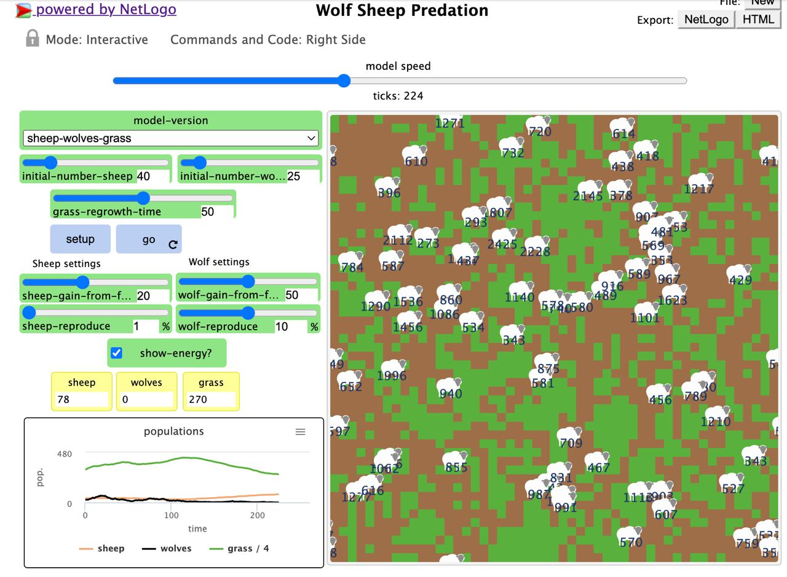
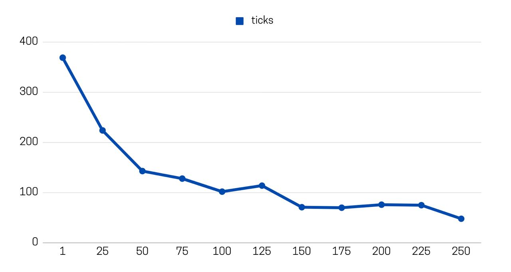
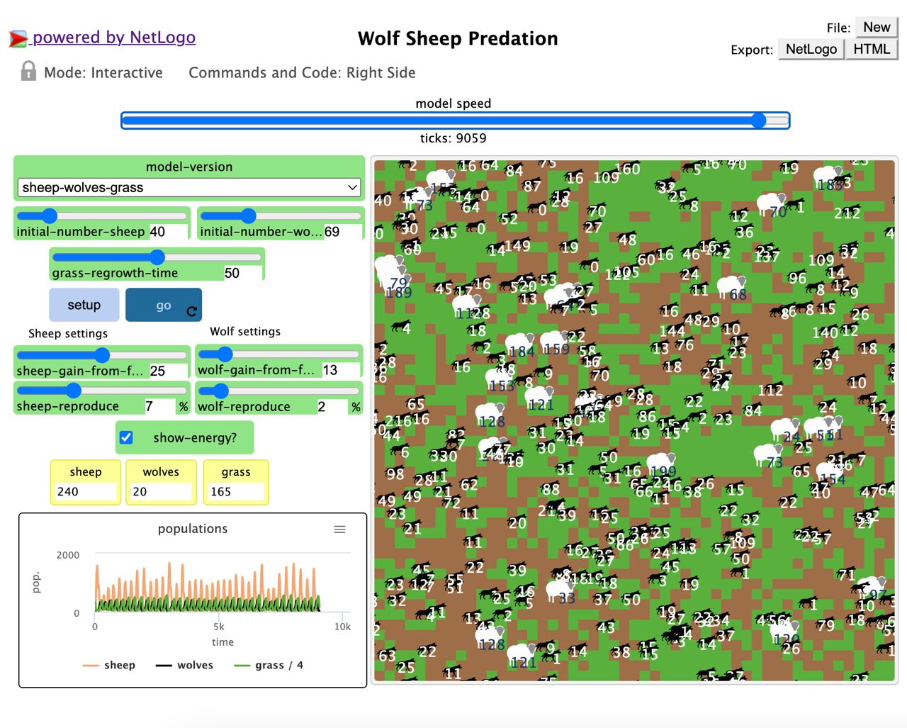
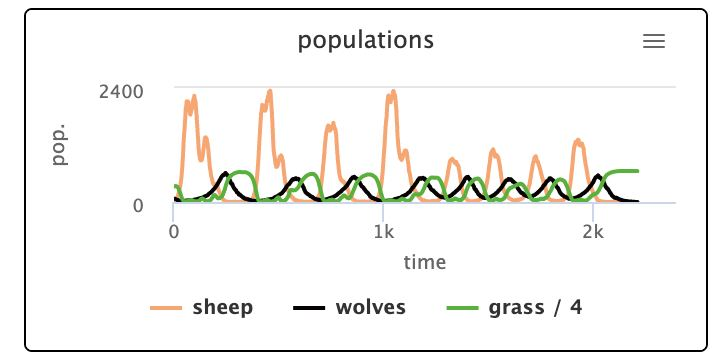

## Імітаційне моделювання комп'ютерних систем
## СПм-21-2, **Корнієнко Єгор Дмитрович**
### Лабораторна робота №**1**. Опис імітаційних моделей

 

### Обрана модель в середовищі NetLogo:
[Wolf Sheep Predation](http://www.netlogoweb.org/launch#http://www.netlogoweb.org/assets/modelslib/Sample%20Models/Biology/Wolf%20Sheep%20Predation.nlogo)

 

### Вербальний опис моделі:
Модель досліджує стабільність екосистем хижак-жертва. Така система називається нестабільною, якщо вона має тенденцію призводити до вимирання одного або кількох видів. Навпаки, система є стабільною, якщо вона прагне підтримувати себе протягом тривалого часу, незважаючи на коливання чисельності населення.

### Керуючі параметри:
- **initial-number-sheep** визначає початкову кількість овець.
- **initial-number-wolves** визначає початкову кількість вовків.
- **show-energy?** визначає чи потрібно відображати поточну енергію кожних окремих вовка чи вівці на карті.
- **grass-regrowth-time** визначає час відростання трави.
- **wolf-gain-from-food** визначає кількість відносної енергії, яку отримає вовк при куштуванні однієї вівці.
- **sheep-gain-from-food** визначає кількість відносної енергії, яку отримає вівця при коштуванні однієї клітинки трави.
- **wolf-reproduce** визначає ймовірність того, що на цій клітині станеться розмноження.
- **sheep-reproduce** визначає ймовірність того, що на цій клітині станеться розмноження.

### Внутрішні параметри:
- **energy**. Енергія для обох учасників процесу (вівці та вовка). Може відрізнятися у кожної тварини в різні моменти модельного часу.

### Критерії ефективності системи:
- стабільність життєдіяльності вівців.
- кількість тактів, яку змогла протриматися популяція вівців.
- кількість тактів, яку змогла протриматися популяція вовків.

### Примітки:
- якщо на карті не залишається ні вовків, ні вівців, то симуляція завершується.
- симуляція моделі неможлива, коли на має жодного її учасника.
- вовки не можуть існувати без вівець, оскільки їх енергія залежить від кількості спожитих вівець.
- симуляція дієва, коли на полі не має вовків, ми можемо розуміти: як розмножуються вівці.

### Недоліки моделі:
- перманентна сто відсоткова імовірність того, що вовк не з'їсть вівцю, коли вони опиняться на однії клітинці поля, що робить систему менш гнучкою.
- відсутній алгоритм пошуку трави для вівець.
- відсутній алгоритм пошуку вівець для вовків.
- відсутність опціонального параметра "початкова енергія", параметр визначається за допомогою random.
- при симуляції з однією вівцею є вирогідність того, що вівця матиме на початку 0 одиниць енергії, а на наступному кроку загине.

 

## Обчислювальні експерименти

### 1. Імовірність попадання в одну клітину вовка та вівці, як ключовий параметр виживання популяції ( за незначної стартової кількості показників популції ).
Досліджуємо залежність середнього розміру популяції від початкової кількості плодових кущів, в умовах коли параметри симуляції дозволяють популяції виживати достатньо довго (більше 5000 тактів). Експерименти проводилися з початковою кількістю плодових кущів від 0 до 40, з кроком 10, всього 5 симуляцій.
Параметри системи, при яких здійснювалась симуляція:
- **initial-number-sheep** : 1.
- **initial-number-wolves** : 25.
- **show-energy?** : true.
- **grass-regrowth-time** : 50.
- **wolf-gain-from-food** : 100.
- **sheep-gain-from-food** : 10.
- **wolf-reproduce** : 10.
- **sheep-reproduce** : 1.

<table>
<thead>
<tr><th>Номер симуляції</th><th>Виживання вівців</th></tr>
</thead>
<tbody>
<tr><td>1</td><td>так</td></tr>
<tr><td>2</td><td>так</td></tr>
<tr><td>3</td><td>ні</td></tr>
<tr><td>4</td><td>ні</td></tr>
<tr><td>5</td><td>так</td></tr>
<tr><td>6</td><td>ні</td></tr>
<tr><td>7</td><td>ні</td></tr>
</tbody>
</table>

При однакових параметрах симуляція демонструє, що головним фактором виживання овець, при незначної кількості вовків є імовірність попадання в одну й ту ж саму клітину вовка на вівці.

### 2. Вплив кількості вовків на тривалість їх популяції.
Досліджуємо залежність кількості вовків на тривалість їх популяцїї.
Експеримент проводився с однаковими параметрами, змінювався леши параметр кількість вовків. ( крок - 25 вовків ) 
Параметри системи, при яких здійснювалась симуляція:
- **initial-number-sheep** : 40.
- **initial-number-wolves** : кількість змінна.
- **show-energy?** : true.
- **grass-regrowth-time** : 50.
- **wolf-gain-from-food** : 50.
- **sheep-gain-from-food** : 20.
- **wolf-reproduce** : 10.
- **sheep-reproduce** : 1.

<table>
<thead>
<tr><th>Кількість вовків</th><th>Середній термін популяції</th></tr>
</thead>
<tbody>
<tr><td>1</td><td>369</td></tr>
<tr><td>25</td><td>224</td></tr>
<tr><td>50</td><td>143</td></tr>
<tr><td>75</td><td>128</td></tr>
<tr><td>100</td><td>102</td></tr>
<tr><td>125</td><td>114</td></tr>
<tr><td>150</td><td>71</td></tr>
<tr><td>175</td><td>70</td></tr>
<tr><td>200</td><td>76</td></tr>
<tr><td>225</td><td>75</td></tr>
<tr><td>250</td><td>48</td></tr>
</tbody>
</table>

Дослідження на одному з етапів

Залежність терміну популяції вовків від первісної їх кількості

Графіки наочно показують, що чим більша кількість вовків, тим менший термін їх популяції. Це демонструє, що в деяких випадках є сенс штучно збільшити кількість шкідливих об'єктів, щоб вони зникли повністю. Принцип може бути застосованим у біології.

### 3. Підбір значень керуючих параметрів, щоб система стала стабільної.
Досліджуємо значення параметрів при яких система перейде у стабільний стан. Експеримент проводився для кількості тактів до 10000, всього 2 симуляції.
Параметри системи, при яких система є стабільною:
- **initial-number-sheep** : 40.
- **initial-number-wolves** : 69.
- **show-energy?** : true.
- **grass-regrowth-time** : 50.
- **wolf-gain-from-food** : 13.
- **sheep-gain-from-food** : 25.
- **wolf-reproduce** : 2.
- **sheep-reproduce** : 7.

Дослідження

 
Поточні параметри не є унікальними, тестування проводилося також на схожих параметрах з похибкою до 4 відсотків. Зміна керуючого параметру sheep-gain-from-food до 35 призвела до того, що система зарекомендувала себе нестабільною вже на 2000 такті. 
Дослідження

